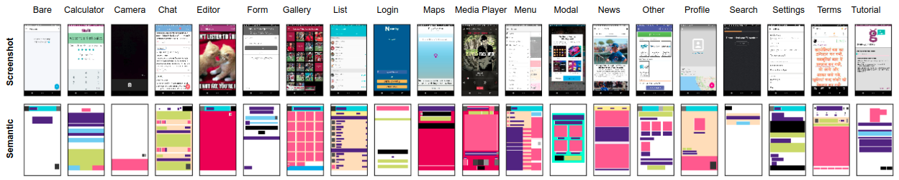
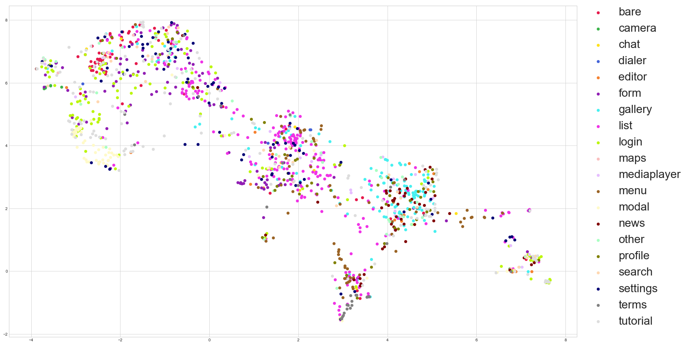

# Enrico

We have manually curated a random sample of 10k UIs from [Rico](https://interactionmining.org/rico),
a large dataset of mobile apps, and have concluded to Enrico (shorthand of Enhanced Rico),
a high-quality dataset comprising 1460 UIs classified according to 20 design topics.





## Design topics overview

| Topic name  | Num. UIs | Description                        |
| :---        |     ---: | :---                               |
| Bare        |       76 | Largely unused area                |
| Dialer      |        6 | Number entry                       |
| Camera      |        8 | Camera functionality               |
| Chat        |       11 | Chat functionality                 |
| Editor      |       18 | Text/Image editing                 |
| Form        |      103 | Form filling functionality         |
| Gallery     |      144 | Grid-like layout with images       |
| List        |      265 | Elements organized in a column     |
| Login       |      141 | Input fields for logging           |
| Maps        |        9 | Geographic display                 |
| MediaPlayer |       32 | Music or video player              |
| Menu        |       79 | Items list in an overlay or aside  |
| Modal       |       67 | A popup-like window                |
| News        |       59 | Snippets list: image, title, text  |
| Other       |       52 | Everything else (rejection class)  |
| Profile     |       63 | Info on a user profile or product  |
| Search      |       35 | Search engine functionality        |
| Settings    |       90 | Controls to change app settings    |
| Terms       |       39 | Terms and conditions of service    |
| Tutorial    |      163 | Onboarding screen                  |

## Dataset files overview

The dataset include the following files:

* A comma-separated file matching each UI identifier with one of the 20 design topics.
  [Link to file](design_topics.csv)

  ```
  screen_id,topic
  50245,tutorial
  .
  .
  .
  ```

* Screenshot images, in JPG format at 540x960 px resolution.
  [Link to sample file](samples/10594-screenshot.jpg)
  ~
  [Download ZIP file](http://userinterfaces.aalto.fi/enrico/screenshots.zip)
  (110 MB, 157 MB uncompressed)

* Semantic wireframe images, in PNG format at 540x960 px resolution.
  [Link to sample file](samples/10594-wireframe.png)
  ~
  [Download ZIP file](http://userinterfaces.aalto.fi/enrico/wireframes.zip)
  (5.3 MB, 10 MB uncompressed)

* Semantic annotations, in JSON format, with all the [UI components](component_legend.json), [text buttons](textButton_legend.json), and [icons](icon_legend.json) encoded in the wireframes.

* View hierarchies, or DOM-like tree structure, in JSON format.
  [Link to sample file](samples/10594-hierarchy.json)
  ~
  [Download ZIP file](http://userinterfaces.aalto.fi/enrico/hierarchies.zip)
  (1.7 MB, 16 MB uncompressed)

  ```
  { "class": "com.android.internal.policy.PhoneWindow$DecorView", "bounds": ...
  ```

* App metadata, in JSON format. Scrapped from Google Play as of August 2020.
  [Link to sample file](samples/10594-metadata.json)
  ~
  [Download ZIP file](http://userinterfaces.aalto.fi/enrico/metadata.zip)
  (2.8 MB, 8 MB uncompressed)

  ```
  { "title": "Sync.ME - Caller ID, Spam Call Blocker & Contacts", "icon": ...
  ```

<!--
* Machine learning models, in h5 format.
  We provide several topic classifiers trained on 70% of the Enrico UIs.
  Please [read the documentation](ml_models/README.md) for more information.
-->

## Other files

You can download additional files from [the Rico dataset](https://interactionmining.org/rico)
such as UI layout vectors (8 MB), interaction traces (6 GB), and animations (214 GB).
Enrico uses the same screen IDs (UI identifiers), so you can easily match the files in Rico.

## Citation

If you use Enrico, please use the following citation:

- L. A. Leiva, A. Hota, A. Oulasvirta. **Enrico: A High-quality Dataset for Topic Modeling of Mobile UI Designs.** *Proc. MobileHCI Adjunct, 2020.*

```bib
@InProceedings{Leiva20_enrico,
  author    = {Luis A. Leiva and Asutosh Hota and Antti Oulasvirta},
  title     = {Enrico: A High-quality Dataset for Topic Modeling of Mobile {UI} Designs},
  booktitle = {Proc. MobileHCI Adjunct},
  year      = {2020},
}
```

<!--
## Papers using Enrico

TBA

If you have used Enrico in your own work, email me with your publication details (title, author, venue) and I'll add it to this list.
-->
